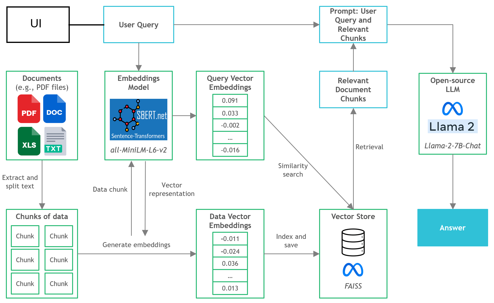
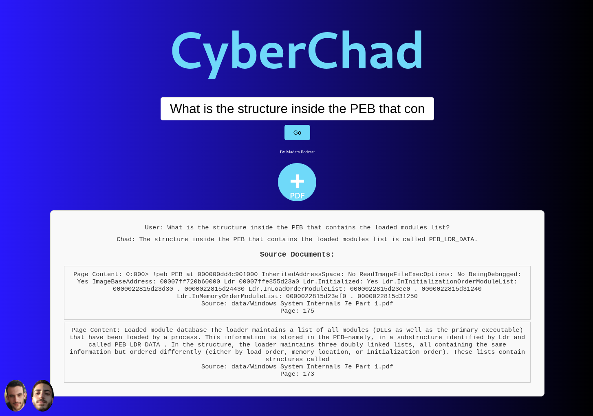

# End to End ChatPDF for enterprise networks (CPU and GPU inference available)

**Step-by-step guide on TowardsDataScience**: https://towardsdatascience.com/running-llama-2-on-cpu-inference-for-document-q-a-3d636037a3d8
___
## Context
- Third-party commercial large language model (LLM) providers like OpenAI's GPT4 have democratized LLM use via simple API calls. 
- However, there are instances where teams would require self-managed or private model deployment for reasons like data privacy and residency rules.
- The proliferation of open-source LLMs has opened up a vast range of options for us, thus reducing our reliance on these third-party providers. 
- When we host open-source LLMs locally on-premise or in the cloud, the dedicated compute capacity becomes a key issue. While GPU instances may seem the obvious choice, the costs can easily skyrocket beyond budget.
- In this project, we will discover how to run quantized versions of open-source LLMs on local CPU inference for document question-and-answer (Q&A).
  

___

## Quickstart
- Ensure you have node installed on your device and npm.
- **Frontend**: Run npm start in the qa directory
- **Backend**: Run python3.8 main.py --local (if you want to run it without the need of OpenAI models) [If you want to make it online use --online] 
  

___
## Tools
- **LangChain**: Framework for developing applications powered by language models
- **C Transformers**: Python bindings for the Transformer models implemented in C/C++ using GGML library
- **FAISS**: Open-source library for efficient similarity search and clustering of dense vectors.
- **Sentence-Transformers (all-MiniLM-L6-v2)**: Open-source pre-trained transformer model for embedding text to a 384-dimensional dense vector space for tasks like clustering or semantic search.
- **Llama-2-7B-Chat**: Open-source fine-tuned Llama 2 model designed for chat dialogue. Leverages publicly available instruction datasets and over 1 million human annotations. 
- **React**: Web development framework
- **FastAPI**: Python backend framework
___
## Files and Content
- `/assets`: Images relevant to the project
- `/config`: Configuration files for LLM application
- `/data`: Dataset used for this project (i.e., Manchester United FC 2022 Annual Report - 177-page PDF document)
- `/models`: Binary file of GGML quantized LLM model (i.e., Llama-2-7B-Chat) 
- `/src`: Python codes of key components of LLM application, namely `llm.py`, `utils.py`, and `prompts.py`
- `/vectorstore`: FAISS vector store for documents
- `db_build.py`: Python script to ingest dataset and generate FAISS vector store
- `main.py`: Main Python script to launch the application and to pass user query via command line
- `pyproject.toml`: TOML file to specify which versions of the dependencies used (Poetry)
- `requirements.txt`: List of Python dependencies (and version)
___

## References
- https://github.com/marella/ctransformers
- https://huggingface.co/TheBloke
- https://huggingface.co/TheBloke/Llama-2-7B-Chat-GGML
- https://python.langchain.com/en/latest/integrations/ctransformers.html
- https://python.langchain.com/en/latest/modules/models/llms/integrations/ctransformers.html
- https://python.langchain.com/docs/ecosystem/integrations/ctransformers
- https://ggml.ai
- https://github.com/rustformers/llm/blob/main/crates/ggml/README.md
- https://www.mdpi.com/2189676
