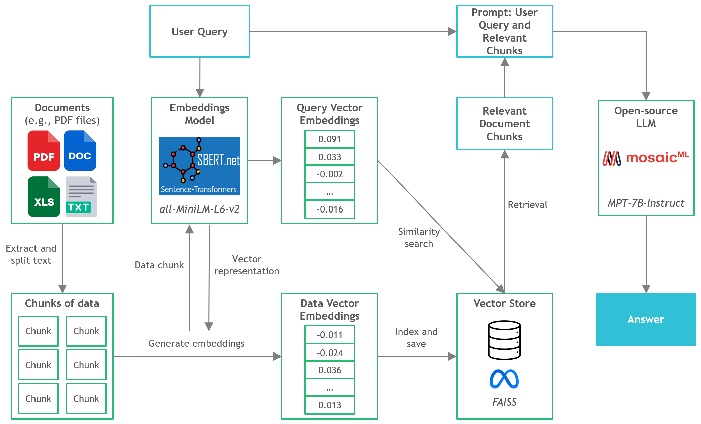

# Running Open-Source LLMs on CPU Inference for Document Q&A

### Clearly explained step-by-step guide on using C Transformers, GGML, and LangChain for running LLM Python applications on CPU instances

**Link to TowardsDataScience article**: *Coming Soon*
___
## Context
- Third-party commercial large language model (LLM) providers like OpenAI's GPT4 have democratized LLM use via simple API calls. 
- However, there are instances where teams would require self-managed or private model deployment for reasons like data privacy and residency rules.
- The proliferation of open-source LLMs has opened up a vast range of options for us, thus reducing our reliance on these third-party providers. 
- When we host open-source LLMs locally on-premise or in the cloud, the dedicated compute capacity becomes a key issue. While GPU instances may seem the obvious choice, the costs can easily skyrocket beyond budget.
- In this project, we will discover how to run quantized versions of open-source LLMs on local CPU inference for document question-and-answer (Q&A).
  

___
## Tools
- LangChain: 
- C Transformers: Python
- FAISS:
- Sentence-Transformers (all-MiniLM-L6-v2): 
- MPT-7B-Instruct (LLM): 

___
## Files

___

## References
- https://github.com/marella/ctransformers
- https://huggingface.co/TheBloke
- https://python.langchain.com/en/latest/integrations/ctransformers.html
- https://python.langchain.com/en/latest/modules/models/llms/integrations/ctransformers.html
- https://python.langchain.com/docs/ecosystem/integrations/ctransformers
- https://github.com/rustformers/llm/blob/main/crates/ggml/README.md
- https://huggingface.co/TheBloke/MPT-7B-Instruct-GGML
